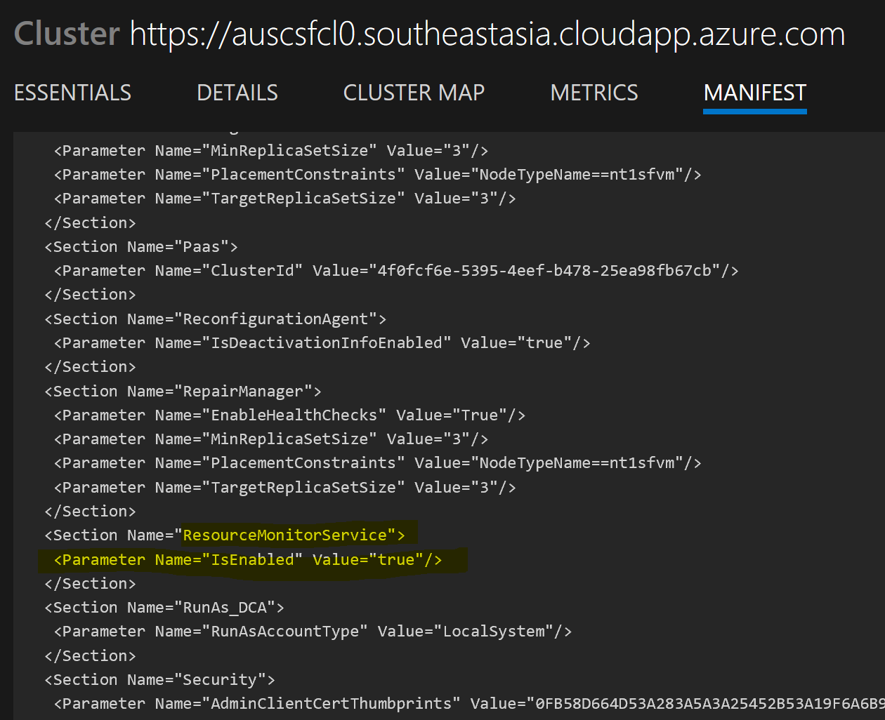

# az-service-fabric-service-autoscaling
Demonstration of Service level auto scaling in Azure Service Fabric.
Azure Service Fabric provides orchestration services for Applications deployed as Docker containers, along with Service instance level autoscaling. In this example, a Web API is built using ASP.NET Core 2.0, packaged using Docker containers for Linux and deployed to an Azure Service Cluster. 
## Creating the Service Fabric Cluster
This feature requires version 6.2.194.1+ of Azure Service Fabric, and enabling the 'Resource Monitor Service' on the Cluster. Since the Azure Portal does not provde an option enable this Service at this time, I am using an ARM Template (1-Nodetype-elb-SFCluster-oms.json) that deploys a cluster with this feature enabled. 

To run this ARM Template, you would require the following handy that is specific to your Azure Subscription:
1. The Key Vault URL
````
"sourceVaultValue": {
    "type": "string",
    "defaultValue": "/subscriptions/<your subcription id>/resourceGroups/<ur rg>/providers/Microsoft.KeyVault/vaults/<ur keyvault>",
     },
 ````
 2. Secret URL to the Certificate in Key Vault
 ````
  "certificateUrlValue": {
            "type": "string",
            "defaultValue": "https://<ur kv>.vault.azure.net/secrets/<ur secret name>/9a36a8986cb041d5ba45089ffcdbd92d",
        },
  ````
3. Thumbprint of the above certificate in Key Vault
````
    "certificateThumbprint": {
            "type": "string",
            "defaultValue": "<certificate thumb print>",
        },
````
4. Thumbprint of the Admin client certificate on the local Dev machine
````
 "clientCertificateStoreValue": {
            "type": "string",
            "defaultValue": "<thumbprint admin client>",
        },
````
After the Service Fabric Cluster is provisioned, launch the Explorer to check the Cluster Manifest. The Resource Monitor Service would be enabled. See below


