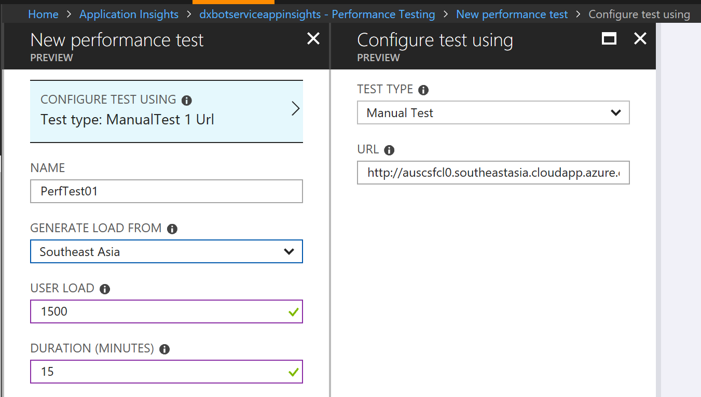
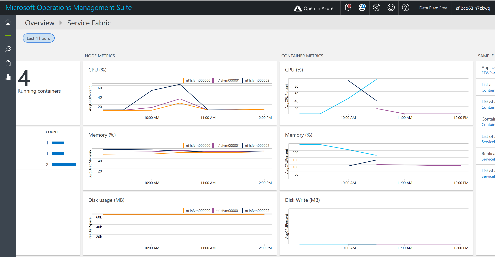
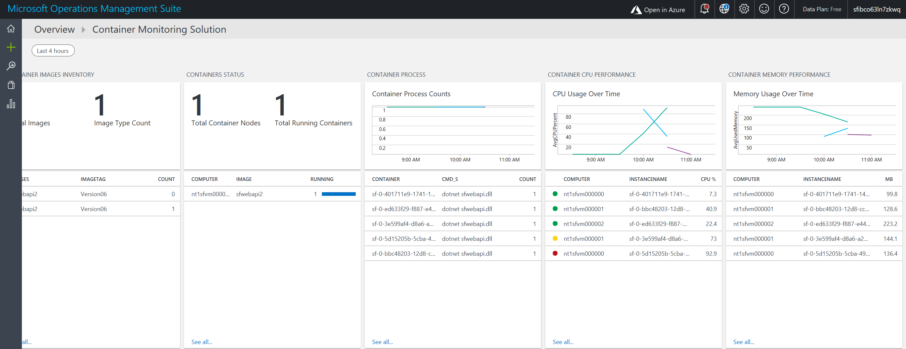

# az-service-fabric-service-autoscaling
Demonstration of Service level auto scaling in Azure Service Fabric.
Azure Service Fabric provides orchestration services for Applications deployed as Docker containers, along with Service type instance level autoscaling. In this example, a Web API is built using ASP.NET Core 2.0, packaged using Docker containers for Linux and deployed to an Azure Service Cluster. 
## Creating the Service Fabric Cluster 
*(mandatory step to run this sample)*

This feature requires version 6.2.194.1+ of Azure Service Fabric, and enabling the 'Resource Monitor Service' on the Cluster. Since the Azure Portal does not provde an option enable this Service at this time, I am using an ARM Template (1-Nodetype-elb-SFCluster-oms.json) that deploys a cluster with this feature enabled. 
*The VM Size of D1_v2 is used in this ARM Template to easily simulate the CPU load leading to an auto scale trigger*

To run this ARM Template, you would require the following handy that is specific to your Azure Subscription:
1. The Key Vault URL
````
"sourceVaultValue": {
    "type": "string",
    "defaultValue": "/subscriptions/<your subcription id>/resourceGroups/<ur rg>/providers/Microsoft.KeyVault/vaults/<ur keyvault>",
     },
 ````
 2. Secret URL to the Certificate in Key Vault
 ````
  "certificateUrlValue": {
            "type": "string",
            "defaultValue": "https://<ur kv>.vault.azure.net/secrets/<ur secret name>/9a36a8986cb041d5ba45089ffcdbd92d",
        },
  ````
3. Thumbprint of the above certificate in Key Vault
````
    "certificateThumbprint": {
            "type": "string",
            "defaultValue": "<certificate thumb print>",
        },
````
4. Thumbprint of the Admin client certificate on the local Dev machine
````
 "clientCertificateStoreValue": {
            "type": "string",
            "defaultValue": "<thumbprint admin client>",
        },
````
*The ARM Template provisions an OMS Repository for Log analytics and monitoring, and to keep the Template simple, the Region used for it is the same as that of the Service Fabric Cluster itself. Ensure that OMS Service is available in the Azure region selected for the Service Fabric Cluster*

Run the ARM Template to create the Cluster. After the Service Fabric Cluster is provisioned, launch the Explorer to check the Cluster Manifest. The Resource Monitor Service would be enabled. See below


## Packaging the sample Application  
*(Step not mandatory to run the sample. The container image is already packaged)*

An ASP.NET Core 2.0 Web API Project is packaged using Docker Container for Linux. It implements an API that performs a CPU intensive task that would be used to trigger a Service instance scale out action on the Service Fabric Cluster
````
 public class OperationsController : Controller
    {
        // GET api/Operations
        [HttpGet]
        public IEnumerable<string> Get
        
        {
            double answer = 0;
            for (int i = 0; i < 5000000; i++)
            {
                Random r = new Random();
                double d = r.Next(1, 9999999);
                answer = Math.Sqrt(d);
            }
            return new string[] { "Longrunning calculation", "answer :"+answer };
        }
    }
````
The Docker container has been uploaded to Docker Hub and referenced in the Service Manifest of the Service Fabric Application.

## Deploying the sample Application  to the Service Fabric Cluster 

Navigate to the folder where this Github Repository is cloned to. The 'app-packages' folder contains the Application packages in the sample. Use GitBash or other tools to deploy the Service Fabric Application. 

### Key configurations implemented in the package for auto scaling
- For autoscaling to work, the ServicePackageActivationMode needs to be set to 'Exclusive' (the default mode is 'shared')
- The autoscale trigger rule and metric name and threshold values need to be specified. Refer to https://docs.microsoft.com/en-us/azure/service-fabric/service-fabric-cluster-resource-manager-autoscaling for details.
- The instance count for the Service type is set to 1. When the auto scale kicks in, more instances of the container would be activated in the Service Fabric Cluster.

The section from Application Manifest file relevant to this configuration is shown below.
````
<DefaultServices>
      <Service Name="sfapi" ServicePackageActivationMode="ExclusiveProcess">
         <StatelessService ServiceTypeName="sfapiType" InstanceCount="1">
            <SingletonPartition />
            <ServiceScalingPolicies>
                <ScalingPolicy>
                    <AveragePartitionLoadScalingTrigger MetricName="servicefabric:/_CpuCores" LowerLoadThreshold="0.5" UpperLoadThreshold="0.70" ScaleIntervalInSeconds="120"/>
                    <InstanceCountScalingMechanism MinInstanceCount="1" MaxInstanceCount="3" ScaleIncrement="1"/>
                </ScalingPolicy>
            </ServiceScalingPolicies>
         </StatelessService>
      </Service>
   </DefaultServices>
</ApplicationManifest>
````

The relevant config from the Service Manifest for the Application is a shown below, that refers to the Container image uploaded to Docker Hub.
````
 <ContainerHost>
    <ImageName>srikantan67/sfwebapi2:Version06</ImageName>
    <Commands></Commands>
 </ContainerHost>
````
### Connect to the Cluster and install the application  
*(mandatory step to run the sample)*

````
sfctl cluster select --endpoint https://<yourcluster>.<region>.cloudapp.azure.com:19080 --pem opennetclcert.pem --no-verify

./install.sh
````
Ensure the Application is running: url in this sample - http://auscsfcl0.southeastasia.cloudapp.azure.com:5002/api/Operations

In the Service Fabric Explorer, you will observe that only one container instance of this application would be running in one of the Nodes in the Service Fabric Cluster.

### Enable the OMS Agent for Linux in the VM Scale set running Service Fabric 
*(optional step. Required only to view the metrics in the OMS Repository)*

This agent is required in the Nodes running the containerised Application, to capture the container logs and push them to the OMS Repository. These are to be activated after the application is deployed to the Cluster, since Docker has to be installed on the Nodes prior to activating this Extension. Refer to https://docs.microsoft.com/en-us/azure/log-analytics/log-analytics-containers for more details. For the OMS Solution for Service Fabric, refer to https://docs.microsoft.com/en-us/azure/log-analytics/log-analytics-service-fabric#configure-log-analytics-to-collect-and-view-service-fabric-logs
From the Azure Portal, obtain the Workspace ID and Secret of the OMS Repository and execute the the CLI command below:

````
az vmss extension set --name OmsAgentForLinux --publisher Microsoft.EnterpriseCloud.Monitoring --resource-group  <ur sf rg name> --vmss-name <ur sf vmss name> --settings "{'workspaceId':'<oms workspace id>'}" --protected-settings "{'workspaceKey':'<workspace key>'}"
````
This actions takes a few minutes to complete.

## Run a Load Test and test the service type level autoscaling 
*(mandatory step to run the sample)*

I have used Application Insights to configure a manual load test that hits the REST API url with 1500 concurrent users, and a test duration of 15 minutes.



## View the Service Fabric Explorer 
*(Required step)*

Observe the Service Fabric Explorer as the test progresses. After some time, you will notice additional container instances running in the other Nodes in the cluster. After the test completes, the additional container instances would get removed from the Explorer view.

## View the Container logs and Node metrics of Service Fabric  as captured in OMS 
*(optional step. required only to view the metrics in OMS)*

Launch the OMS Workspace and launch the Container Logs and Service Fabric Solutions (these were deployed in the OMS Workspace when the ARM Template was run).

The screen shot below shows how over the course of the Load Test, additional container instances were deployed in the other Nodes in the Cluster, on trigger of the auto scaling rules. Once the Load came down on completion of the Test, the additional container instances were removed by the auto scaling rule.



Below is a screen shot from the Container log Solution in OMS, for the duration when the Load test was run.



